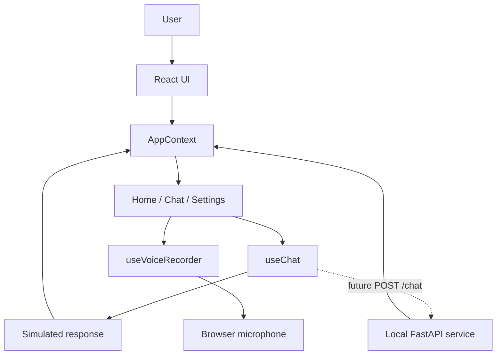

# Overseer - Private Local AI Assistant

<p align="center">
  
</p>

<p align="center">
  A focused, privacy-first chat experience for fast local AI interaction.
</p>

## Overview

Overseer is a mobile-first AI assistant interface built around the idea that useful AI should feel immediate, personal, and private. The application provides a polished chat workflow for a locally hosted model, with a visual system designed to make model state and interaction feel tangible rather than hidden behind a generic form.

The project is currently a frontend prototype and interaction layer. It demonstrates the product experience, state architecture, browser capabilities, and intended backend integration point. Chat responses and voice transcription are simulated in the current build so the interface can be evaluated without a running inference server.

## Key Features

- Local-first assistant experience with explicit privacy and on-device model messaging.
- Home screen with animated AI orb, model status, quick actions, and an always-available composer.
- Conversation screen with user and assistant message bubbles, timestamps, loading state, suggested prompts, copy interaction, and clear-chat controls.
- Conversation history in a slide-out sidebar with active conversation selection and new-chat creation.
- Text, file attachment, and voice input flows through a shared message composer.
- Browser microphone capture using `MediaRecorder`, `AudioContext`, and live audio-level analysis.
- Voice recording overlay with animated waveform, listening state, processing state, and cancel/stop actions.
- Profile customization with editable display name, generated initials, and local avatar upload preview.
- Five configurable visual themes: Violet, Emerald, Cyan, Rose, and Amber.
- Responsive mobile-width composition capped at `430px`, with animated page transitions and reduced visual noise around the primary workflow.
- TypeScript domain types for messages, conversations, settings, themes, and quick actions.

## Product Experience

### Home

The home screen acts as a compact command center. It communicates model readiness, introduces the assistant through the animated orb, exposes high-value starter actions, and keeps the composer close to the bottom edge for one-handed use.

### Chat

Each conversation has a title derived from its first prompt and is stored in the application state. Messages support text, voice, and file metadata, while assistant responses show a loading indicator before appearing. The empty chat state offers prompt suggestions to reduce the blank-page effect.

### Settings

Settings are organized around the profile, visual identity, model status, and future preferences. Users can change their name, upload an avatar, select an accent theme, and inspect the configured model label.

### Voice interaction

The voice flow requests microphone access, records audio in the browser, visualizes the input level, and returns the captured interaction to the composer. The transcription callback is intentionally isolated so it can later be replaced with a Whisper or other speech-to-text service.

## Architecture

Overseer is a single-page React application with a small, explicit state layer. The current architecture keeps UI composition, app state, interaction hooks, and design tokens separate without introducing unnecessary infrastructure.

### Major components

- `src/App.tsx`: Application shell, route-like view selection, ambient background, and screen transitions.
- `src/contexts/AppContext.tsx`: Shared state for navigation, settings, conversations, active conversation, themes, and sidebar visibility.
- `src/components/home/`: Home screen, quick actions, and first-run assistant experience.
- `src/components/chat/`: Conversation rendering, message bubbles, typing indicator, and chat controls.
- `src/components/settings/`: Profile, model, theme, and preference presentation.
- `src/components/ui/`: Reusable assistant orb, avatar, sidebar, message composer, and voice overlay.
- `src/hooks/`: Chat orchestration and browser voice recording behavior.
- `src/types/`: Shared TypeScript contracts for messages, conversations, settings, and quick actions.
- `src/utils/themes.ts`: Centralized theme and orb color configuration.

### Data flow

1. A user starts a conversation from the home screen, sidebar, quick action, or composer.
2. `AppContext` creates and tracks the active conversation.
3. `MessageInput` emits text, file, or voice metadata to the screen that owns it.
4. `useChat` adds the user message, exposes loading state, and currently generates a simulated assistant response.
5. The chat screen renders the conversation and scrolls to the newest message.
6. Settings updates flow through the context and immediately update the active theme, avatar, and user identity across the app.

### Backend integration boundary

The chat hook contains the intended integration point for a local FastAPI service. The commented request contract is designed around a `POST /chat` endpoint that accepts the current message and conversation history, then returns an assistant response. This keeps the UI testable now while leaving the inference transport easy to replace.



## Technology Stack

- **Frontend:** React 18, TypeScript, Vite
- **Styling:** Tailwind CSS 4, custom CSS animation and glass UI utilities
- **Icons:** `lucide-react`
- **State:** React Context and focused custom hooks
- **Browser APIs:** Canvas 2D, `MediaRecorder`, `AudioContext`, `FileReader`, Clipboard API
- **Quality tooling:** TypeScript project builds, ESLint 9, Vite production bundling
- **Intended service integration:** Local AI model exposed through a FastAPI `/chat` endpoint

## Repository Structure

```text
myapp/
├── public/                  # Static public assets
├── src/
│   ├── assets/              # Application assets and visual resources
│   ├── components/
│   │   ├── chat/            # Chat screen and message presentation
│   │   ├── home/            # Home screen and quick actions
│   │   ├── settings/        # Settings screen
│   │   └── ui/              # Shared interaction and visual components
│   ├── contexts/            # Shared application state
│   ├── hooks/               # Chat and voice behavior
│   ├── types/               # TypeScript domain models
│   ├── utils/               # Theme definitions
│   ├── App.tsx              # Application composition
│   ├── App.css              # Supporting component styles
│   └── index.css            # Global styles and animations
├── index.html
├── package.json
├── tsconfig.app.json
├── tsconfig.node.json
├── vite.config.ts
└── eslint.config.js
```

## Engineering Highlights

- **Clear state ownership:** Cross-screen behavior is centralized in `AppContext`, while device-specific behavior remains in hooks.
- **Reusable interaction surface:** The same `MessageInput` handles text, attachments, and voice capture across home and chat views.
- **Visual feedback as product behavior:** Loading indicators, audio levels, animated orb states, theme-driven glows, and transitions communicate system state without interrupting the flow.
- **Accessible browser capability boundaries:** Microphone and file access are requested only from direct user actions and remain replaceable at the service boundary.
- **Responsive constraints:** The app uses a narrow, stable mobile composition while preserving a centered presentation on larger screens.
- **Extensible domain model:** Message types already distinguish text, voice, and file input, providing a straightforward foundation for multimodal model requests.
- **Design token discipline:** Theme configuration drives gradients, accents, orb colors, rings, and glow values from one typed source.

## Setup

### Requirements

- Node.js 18 or newer
- npm 9 or newer
- A modern browser for microphone and file interaction testing

### Installation

```bash
npm install
```

### Run locally

```bash
npm run dev
```

Open the local URL printed by Vite, usually `http://localhost:5173`.

### Production build

```bash
npm run build
npm run preview
```

### Quality checks

```bash
npm run lint
```

## Demo Workflow

1. Open Overseer and review the local model status on the home screen.
2. Use a quick action or type a prompt into the composer.
3. Review the simulated assistant response and loading state in the chat view.
4. Open the sidebar to revisit the conversation or start another one.
5. Attach an image or document to exercise file metadata and preview handling.
6. Use the microphone control to inspect the recording overlay and live waveform.
7. Open Settings to update the profile and switch the application theme.

## Current Scope and Next Steps

The current repository intentionally focuses on the frontend experience and interaction architecture. The next implementation stage would connect the existing seams to real services:

- Replace the simulated `useChat` response with a streaming local model request.
- Connect the voice transcript callback to Whisper or another speech-to-text service.
- Persist conversations and settings with IndexedDB or a local database.
- Add real preference toggles for streaming, haptics, and conversation retention.
- Add automated component and browser tests for chat state, file attachments, microphone permissions, and responsive layouts.
- Add request cancellation, retry handling, and an explicit backend health state.
- Add multimodal request serialization for attached images and documents.

## Privacy and Repository Notice

Overseer is designed around a local-first product direction, but the current repository does not ship a model runtime or backend service. Chat generation and transcription are simulated for demonstration purposes. No production credentials are required for the frontend, and users should avoid committing private media or secrets to the repository.

For a complete local AI demonstration, connect the documented `/chat` boundary and transcription callback to the preferred private inference services.
